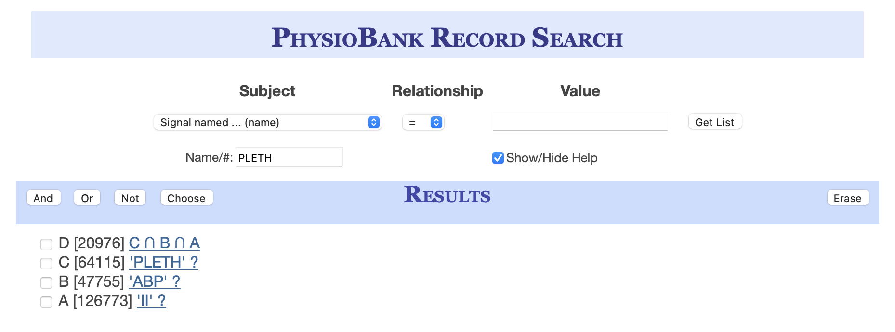

# Querying list of MIMIC IDs

We are interested in the set of MIMIC patients who are part of the matched clinical database, and also have MIMIC waveform records that contain continuous blood pressure (ABP), photoplethysmogram (PPG, or PLETH), and lead II of the electrocardiogram (ECG).

To get this list of patients, we use the [PhysioBank Record Search tool](https://archive.physionet.org/cgi-bin/pbsearch?help_on=on)

In the tool, we select records with signal names equal to `II` (i.e. ECG), `PLETH`, and `ABP`. Then, we take the intersection of the record list (an AND operation). See the screenshot below for an example of what we should see.  



Download this list of record IDs to a file (for example, `ECG_PLETH_ABP_IDs.txt`) by right clicking on the intersection query (eg. option D in the screenshot).
Of these records, we then grep for records with the `mimic3wdb` record prefix, trim the prefix, and pipe the results into a separate file. 
```
grep 'mimic3wdb' ECG_PLETH_ABP_IDs.txt | cut -f 3- -d / > ECG_PLETH_ABP_IDs_wdb3_matched.txt
```

This will result in the list of MIMIC records from version 3 of the matched waveform database that contain ABP, PLETH, and II signals. 

# Downloading the raw MIMIC data

With the list of records that contain the signals of interest, we can now download the raw MIMIC data. The script [download_mimic_raw.sh](download_mimic_raw.sh) will use wget to download each record in the file `ECG_PLETH_ABP_IDs_wdb3_matched.txt`. Note that this may take a long time depending on your Internet download speed, and the data is very large so you may need to change the save location in the script to specify a directory with plenty of disk space. 

# Creating .csv files from raw MIMIC data

To aggregate the raw MIMIC waveform files into a more usable format, we use the [make_dataset.py](make_dataset.py) script.
This script leverages the [wfdb python package](https://github.com/MIT-LCP/wfdb-python) for working with the  MIMIC data. It is available via pip, and can be installed using the command 

```
pip install wfdb
```

This script does several things:

1. Reads the MIMIC records using the wfdb package
2. Creates a pandas DataFrame with the signals, indexed by the waveform timestamp extracted from the MIMIC record
3. Downsamples the signals to a common frequency (default is 100Hz)
4. Calculates pseudo-NIBP values by sampling the ABP waveform at regular intervals (eg. 5 mins)
5. Writes dataframe to .csv.gz file
